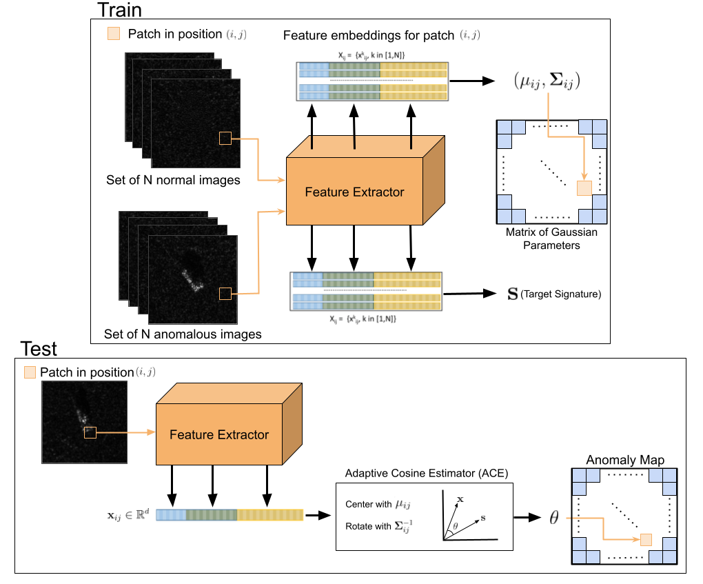

# Patch distribution modeling framework adaptive cosine estimator (PaDiM-ACE) for anomaly detection and localization in synthetic aperture radar imagery

_Angelina Ibarra and Joshua Peeples_



[`arXiv`](https://arxiv.org/abs/2504.08049)

## Overview
This repository contains PaDiM-ACE, a computer vision model inspired by PaDiM designed for anomaly detection in Synthetic Aperture Radar (SAR) images, It leverages the model implementation of PaDiM from [Anomalib](https://anomalib.readthedocs.io/).

## Directory Structure
```
PaDiM-ACE/
├── README.md
├── demo.py 
├── src/
│   ├── anomalib/
│       ├── models/
│           ├── image/
│               ├── padim/
│                   ├── anomaly_map.py
│                   ├── lightning_model.py
│                   ├── loss.py
│                   ├── torch_model.py
├── datasets/
│   ├── MSTAR/
│       ├── train/
│            ├── norm
│            ├── anom
│       ├── test/
│            ├── norm
│            ├── anom
│       ├── ground_truth/
│            ├── anom 
│   ├── HRSID/
│       ├── train/
│            ├── norm
│            ├── anom
│       ├── test/
│            ├── norm
│            ├── anom
│       ├── ground_truth/
│            ├── anom
│   └── SSDD/ 
│        ├── train/
│            ├── norm
│            ├── anom
│       ├── test/
│            ├── norm
│            ├── anom
│       ├── ground_truth/
│            ├── anom
```

## Installation
This code uses python and necessary packages in pytorch.

```bash
git clone https://github.com/Advanced-Vision-and-Learning-Lab/PaDiM-ACE
cd PaDiM-ACE
pip install -e .
```
## Demo

Run `demo.py` in Python IDE (e.g., Spyder) or command line. 

# Training

```python
from anomalib.data import Folder
from anomalib.models import Padim
from anomalib.engine import Engine

# Initialize components
datamodule = Folder(
    name="HRSID",
    root="./datasets/HRSID",
    mask_dir="./ground_truth",
    normal_dir="./train/norm",
    abnormal_dir="./test/anom",
    train_batch_size=16,
    eval_batch_size=16
)
datamodule.setup()
model = Padim(loss="lace")
engine = Engine()

# Train the model
engine.fit(datamodule=datamodule, model=model)

# Test the model 
engine.test(model=model, datamodule=datamodule)
```


## Acknowledgments
This project is inspired by [Anomalib](https://anomalib.readthedocs.io/) and [PaDiM: a Patch Distribution Modeling Framework for Anomaly Detection and Localization
](https://arxiv.org/abs/2011.08785).

## Contributing
Contributions are welcome! To contribute:
1. Fork the repository on GitHub.
2. Create a new branch with a descriptive name.
3. Make your changes and ensure they follow the code style guidelines.
4. Write unit tests for any new features or bug fixes.
5. Submit a pull request with a clear description of your changes.

For major changes, please open an issue first to discuss what you'd like to change. We appreciate your contributions to improve this work!

## Citing PaDiM-ACE

If you use the PaDiM-ACE code, please cite the following reference using the following entry.

**Plain Text:**

A. Ibarra and J. Peeples, "Patch distribution modeling framework adaptive cosine estimator (PaDiM-ACE) for anomaly detection and localization in synthetic aperture radar imagery" in Algorithms for Synthetic Aperture Radar Imagery XXXII, vol. TBD. International Society for Optics and Photonics (SPIE), 2025, DOI:TBD

**BibTex:**

```
@inproceedings{ibarra2025patchdistributionmodelingframework,
  title={Patch distribution modeling framework adaptive cosine estimator (PaDiM-ACE) for anomaly detection and localization in synthetic aperture radar imagery},
  author={Ibarra, Angelina and Peeples, Joshua},
  booktitle={Algorithms for Synthetic Aperture Radar Imagery XXXII},
  pages={TBD},
  year={2025},
  organization={International Society for Optics and Photonics (SPIE)}
}
```